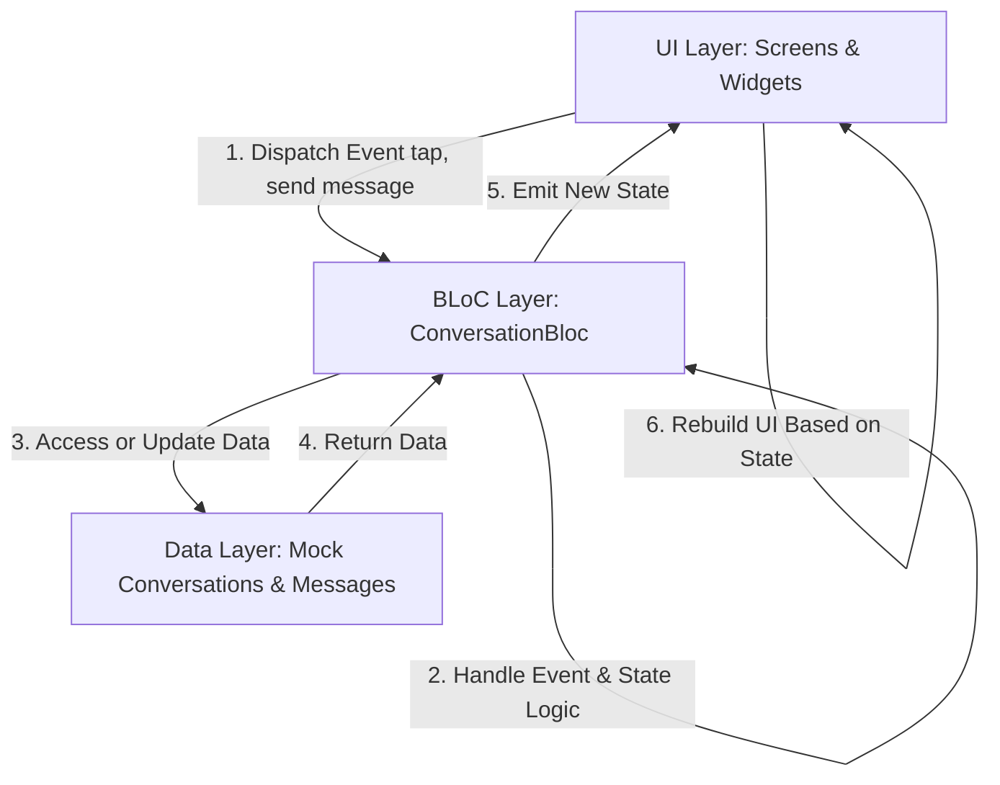
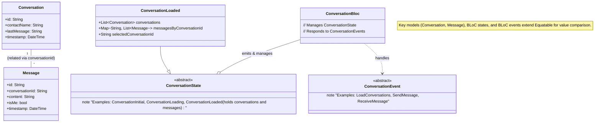

# 💬 Application de Chat Flutter avec Architecture BLoC

## 📋 Table des Matières

- [Vue d'ensemble](#vue-densemble)
- [Fonctionnalités](#fonctionnalités)
- [Architecture](#architecture)
- [Structure du Projet](#structure-du-projet)
- [Installation et Configuration](#installation-et-configuration)
- [Guide d'Utilisation](#guide-dutilisation)
- [Documentation Technique](#documentation-technique)
- [Captures d'Écran](#captures-décran)
- [Contribution](#contribution)

## 🎯 Vue d'ensemble

Cette application de chat moderne développée avec **Flutter** démontre l'implémentation complète de l'architecture **BLoC (Business Logic Component)** pour la gestion d'état. Elle offre une expérience utilisateur fluide avec des fonctionnalités de messagerie en temps réel, une interface Material Design 3, et une architecture scalable.

### 🚀 Objectifs du Projet

- Démontrer l'architecture BLoC dans une application réelle
- Implémenter une interface utilisateur moderne et responsive
- Fournir un exemple complet de gestion d'état complexe
- Servir de référence pour les développeurs Flutter

## ✨ Fonctionnalités

### 🏠 Écran Principal - Liste des Conversations

- **📱 Interface moderne** avec Material Design 3
- **👤 Avatars personnalisés** avec initiales colorées
- **🔴 Badges de notification** pour les messages non lus
- **⏰ Horodatage** des derniers messages
- **➕ Création rapide** de nouvelles conversations (FAB + bouton AppBar)
- **🔄 Simulation** de réception de messages en temps réel

### 💬 Écran de Chat Détaillé

- **💭 Bulles de messages** avec design moderne et ombres
- **🎨 Différenciation visuelle** claire entre messages envoyés/reçus
- **✅ Indicateurs de lecture** (double coche bleue)
- **⌨️ Champ de saisie** avec design arrondi et boutons d'action
- **📎 Boutons d'attachement** (émoji, fichiers, caméra)
- **🔄 Défilement automatique** vers les nouveaux messages

### 🆕 Création de Conversations

- **📝 Formulaire de validation** avec contrôles en temps réel
- **✨ Interface intuitive** avec feedback utilisateur
- **🎯 Intégration BLoC** complète pour la gestion d'état

### 🎯 Fonctionnalités Techniques

- **🏗️ Architecture BLoC** complète et scalable
- **🔄 Gestion d'état** réactive et prévisible
- **📱 Interface responsive** adaptée à tous les écrans
- **🎨 Thème Material Design 3** avec couleurs cohérentes
- **🚀 Performance optimisée** avec Equatable et immutabilité

## 🏗️ Architecture

### 🎯 Principe BLoC (Business Logic Component)

L'application utilise l'architecture **BLoC** pour séparer la logique métier de l'interface utilisateur, garantissant une meilleure testabilité, maintenabilité et scalabilité.

```
UI (Widgets) → Events → BLoC → States → UI (Rebuild)
```

### Structure du projet



### Diagramme de classe du projet



### 📊 États du BLoC (`ConversationState`)

Les états représentent les différentes phases de l'interface utilisateur. Ils sont **immutables** et utilisent **Equatable** pour des comparaisons optimisées.

| État                  | Description                   | Usage                     |
| --------------------- | ----------------------------- | ------------------------- |
| `ConversationInitial` | État initial avant chargement | Écran de démarrage        |
| `ConversationLoading` | Chargement en cours           | Indicateur de progression |
| `ConversationLoaded`  | Données chargées avec succès  | Interface principale      |
| `ConversationError`   | Erreur lors du traitement     | Message d'erreur          |

#### 🔍 Détail de `ConversationLoaded`

```dart
class ConversationLoaded {
  final List<Conversation> conversations;           // Liste des conversations
  final Map<String, List<Message>> messagesByConversationId; // Messages par conversation
  final String? selectedConversationId;            // Conversation active
}
```

### ⚡ Événements du BLoC (`ConversationEvent`)

Les événements déclenchent les actions dans le BLoC. Chaque interaction utilisateur génère un événement spécifique.

| Événement                | Déclencheur           | Action BLoC                  |
| ------------------------ | --------------------- | ---------------------------- |
| `LoadConversations`      | Démarrage app         | Charge les données initiales |
| `ConversationSelected`   | Tap sur conversation  | Met à jour la sélection      |
| `SendMessage`            | Envoi message         | Ajoute message (isMe: true)  |
| `ReceiveMessage`         | Simulation réception  | Ajoute message (isMe: false) |
| `CreateConversation`     | Nouvelle conversation | Crée une conversation        |
| `MarkConversationAsRead` | Ouverture chat        | Remet compteur à 0           |

#### 📤 Exemple: Envoi de Message

```dart
// L'utilisateur tape sur "Envoyer"
context.read<ConversationBloc>().add(
  SendMessage(
    targetConversationId: 'conv1',
    messageContent: 'Hello!',
  ),
);

// Le BLoC traite l'événement:
// 1. Crée un nouveau Message (isMe: true)
// 2. L'ajoute à la conversation
// 3. Met à jour lastMessage et timestamp
// 4. Émet un nouvel état ConversationLoaded
```

## 📱 Fonctionnalités Détaillées

### 1. Écran Liste des Conversations

Cet écran est le point d'entrée principal de l'application après le lancement.

- **Liste des conversations** :
  - Affiche chaque conversation avec un **avatar** (généralement les initiales du contact).
  - Le **nom du contact**.
  - Le **dernier message** échangé dans cette conversation.
  - L'heure du dernier message.
- **Badge pour les messages non lus** :
  - Un indicateur visuel (badge) est affiché à côté d'une conversation s'il y a des messages non lus.
- **Navigation vers l'écran de conversation détaillé** :
  - Un appui (tap) sur une conversation dans la liste navigue l'utilisateur vers l'écran de discussion détaillé pour cette conversation spécifique. L'événement `ConversationSelected` est envoyé au BLoC.
- **Possibilité de créer une nouvelle conversation** :
  - Un bouton d'action flottant (FAB) ou une icône dans l'AppBar permet à l'utilisateur d'initier la création d'une nouvelle conversation.

### 2. Écran de Conversation Détaillé

Cet écran s'affiche lorsque l'utilisateur sélectionne une conversation.

- **Messages de la conversation sélectionnée** :
  - Affiche la liste des messages appartenant à la conversation active, récupérés depuis l'état `ConversationLoaded` du BLoC.
  - Les messages sont affichés dans l'ordre chronologique.
- **Champ de saisie pour envoyer des messages** :
  - Un champ de texte en bas de l'écran permet à l'utilisateur de taper son message.
  - Un bouton "Envoyer" déclenche l'événement `SendMessage` avec le contenu du champ et l'ID de la conversation actuelle.
- **Messages différenciés visuellement** :
  - Les messages envoyés par l'utilisateur (`isMe: true`) sont alignés à droite et stylisés différemment.
  - Les messages reçus du contact (`isMe: false`) sont alignés à gauche avec un style distinct.

### 3. Navigation entre les Écrans

La navigation dans l'application est gérée principalement par `Navigator` de Flutter :

1. **Démarrage** : L'application démarre sur `ConversationListScreen`.
2. **De `ConversationListScreen` à `ChatScreen`** :
   - Lorsqu'un utilisateur appuie sur un élément de la liste des conversations, `Navigator.push()` est appelé.
   - L'ID de la conversation et le nom du contact sont passés en arguments à `ChatScreen`.
   - Simultanément, l'événement `ConversationSelected(conversationId)` est envoyé au `ConversationBloc`.
3. **Retour de `ChatScreen` à `ConversationListScreen`** :
   - Le bouton "retour" de l'AppBar utilise `Navigator.pop()` pour revenir à l'écran précédent.

### 4. Création d'une Nouvelle Conversation

1. **Initiation** : L'utilisateur appuie sur un bouton "Nouvelle Conversation" (FAB) sur l'`ConversationListScreen`.
2. **Saisie du Contact** : L'utilisateur saisit le nom du contact dans un formulaire de validation.
3. **Création dans le BLoC** :
   - Un événement `CreateConversation(contactName)` est envoyé au BLoC.
   - Le BLoC crée une nouvelle instance de `Conversation` et l'ajoute à la liste.
   - Il initialise également une liste de messages vide pour cette nouvelle conversation.
4. **Navigation** : L'application peut naviguer vers le `ChatScreen` pour cette conversation nouvellement créée.

## 🚀 Installation et Configuration

```bash
# Cloner le repository
git clone <repository-url>

# Naviguer dans le dossier
cd chat_app

# Installer les dépendances
flutter pub get

# Lancer l'application
flutter run
```

## 📚 Guide d'Utilisation

1. **Démarrage** : L'application s'ouvre sur la liste des conversations
2. **Navigation** : Tapez sur une conversation pour ouvrir le chat
3. **Envoi de messages** : Utilisez le champ de saisie en bas de l'écran
4. **Nouvelle conversation** : Tapez sur le bouton "+" pour créer une conversation
5. **Test de réception** : Utilisez le bouton message dans l'AppBar pour simuler des messages entrants

## 📖 Documentation Technique

- **Architecture** : BLoC Pattern avec separation des responsabilités
- **Gestion d'état** : Immutable states avec Equatable
- **Navigation** : Flutter Navigator 2.0
- **UI/UX** : Material Design 3 avec thème personnalisé

## 🤝 Contribution

Les contributions sont les bienvenues ! N'hésitez pas à :

1. Fork le projet
2. Créer une branche pour votre fonctionnalité
3. Committer vos changements
4. Pusher vers la branche
5. Ouvrir une Pull Request
