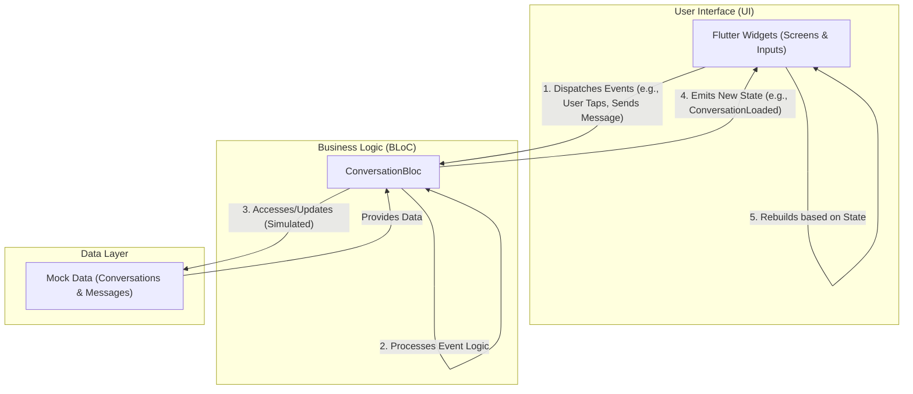

# 💬 Application de Chat Flutter avec Architecture BLoC

## 📋 Table des Matières

- [Vue d'ensemble](#vue-densemble)
- [Fonctionnalités](#fonctionnalités)
- [Architecture](#architecture)
- [Structure du Projet](#structure-du-projet)
- [Installation et Configuration](#installation-et-configuration)
- [Guide d'Utilisation](#guide-dutilisation)
- [Documentation Technique](#documentation-technique)
- [Captures d'Écran](#captures-décran)
- [Contribution](#contribution)

## 🎯 Vue d'ensemble

Cette application de chat moderne développée avec **Flutter** démontre l'implémentation complète de l'architecture **BLoC (Business Logic Component)** pour la gestion d'état. Elle offre une expérience utilisateur fluide avec des fonctionnalités de messagerie en temps réel, une interface Material Design 3, et une architecture scalable.

### 🚀 Objectifs du Projet

- Démontrer l'architecture BLoC dans une application réelle
- Implémenter une interface utilisateur moderne et responsive
- Fournir un exemple complet de gestion d'état complexe
- Servir de référence pour les développeurs Flutter

## ✨ Fonctionnalités

### 🏠 Écran Principal - Liste des Conversations

- **📱 Interface moderne** avec Material Design 3
- **👤 Avatars personnalisés** avec initiales colorées
- **🔴 Badges de notification** pour les messages non lus
- **⏰ Horodatage** des derniers messages
- **➕ Création rapide** de nouvelles conversations (FAB + bouton AppBar)
- **🔄 Simulation** de réception de messages en temps réel

### 💬 Écran de Chat Détaillé

- **💭 Bulles de messages** avec design moderne et ombres
- **🎨 Différenciation visuelle** claire entre messages envoyés/reçus
- **✅ Indicateurs de lecture** (double coche bleue)
- **⌨️ Champ de saisie** avec design arrondi et boutons d'action
- **📎 Boutons d'attachement** (émoji, fichiers, caméra)
- **🔄 Défilement automatique** vers les nouveaux messages

### 🆕 Création de Conversations

- **📝 Formulaire de validation** avec contrôles en temps réel
- **✨ Interface intuitive** avec feedback utilisateur
- **🎯 Intégration BLoC** complète pour la gestion d'état

### 🎯 Fonctionnalités Techniques

- **🏗️ Architecture BLoC** complète et scalable
- **🔄 Gestion d'état** réactive et prévisible
- **📱 Interface responsive** adaptée à tous les écrans
- **🎨 Thème Material Design 3** avec couleurs cohérentes
- **🚀 Performance optimisée** avec Equatable et immutabilité

## 🏗️ Architecture

### 🎯 Principe BLoC (Business Logic Component)

L'application utilise l'architecture **BLoC** pour séparer la logique métier de l'interface utilisateur, garantissant une meilleure testabilité, maintenabilité et scalabilité.

```
UI (Widgets) → Events → BLoC → States → UI (Rebuild)
```

### 📊 États du BLoC (`ConversationState`)

Les états représentent les différentes phases de l'interface utilisateur. Ils sont **immutables** et utilisent **Equatable** pour des comparaisons optimisées.

| État                  | Description                   | Usage                     |
| --------------------- | ----------------------------- | ------------------------- |
| `ConversationInitial` | État initial avant chargement | Écran de démarrage        |
| `ConversationLoading` | Chargement en cours           | Indicateur de progression |
| `ConversationLoaded`  | Données chargées avec succès  | Interface principale      |
| `ConversationError`   | Erreur lors du traitement     | Message d'erreur          |

#### 🔍 Détail de `ConversationLoaded`

```dart
class ConversationLoaded {
  final List<Conversation> conversations;           // Liste des conversations
  final Map<String, List<Message>> messagesByConversationId; // Messages par conversation
  final String? selectedConversationId;            // Conversation active
}
```

### ⚡ Événements du BLoC (`ConversationEvent`)

Les événements déclenchent les actions dans le BLoC. Chaque interaction utilisateur génère un événement spécifique.

| Événement                | Déclencheur           | Action BLoC                  |
| ------------------------ | --------------------- | ---------------------------- |
| `LoadConversations`      | Démarrage app         | Charge les données initiales |
| `ConversationSelected`   | Tap sur conversation  | Met à jour la sélection      |
| `SendMessage`            | Envoi message         | Ajoute message (isMe: true)  |
| `ReceiveMessage`         | Simulation réception  | Ajoute message (isMe: false) |
| `CreateConversation`     | Nouvelle conversation | Crée une conversation        |
| `MarkConversationAsRead` | Ouverture chat        | Remet compteur à 0           |

#### 📤 Exemple: Envoi de Message

```dart
// L'utilisateur tape sur "Envoyer"
context.read<ConversationBloc>().add(
  SendMessage(
    targetConversationId: 'conv1',
    messageContent: 'Hello!',
  ),
);

// Le BLoC traite l'événement:
// 1. Crée un nouveau Message (isMe: true)
// 2. L'ajoute à la conversation
// 3. Met à jour lastMessage et timestamp
// 4. Émet un nouvel état ConversationLoaded
```

## Fonctionnalités Implémentées

### 1. Écran Liste des Conversations

Cet écran est le point d'entrée principal de l'application après le lancement.

- **Liste des conversations** :
  - Affiche chaque conversation avec un **avatar** (généralement les initiales du contact).
  - Le **nom du contact**.
  - Le **dernier message** échangé dans cette conversation.
  - L'heure du dernier message.
- **Badge pour les messages non lus** :
  - Un indicateur visuel (badge) est affiché à côté d'une conversation s'il y a des messages non lus. (Note : Cela nécessiterait un champ `unreadCount` dans le modèle `Conversation` et une logique de mise à jour dans le BLoC lors de la réception de messages si la conversation n'est pas activement visualisée).
- **Navigation vers l'écran de conversation détaillé** :
  - Un appui (tap) sur une conversation dans la liste navigue l'utilisateur vers l'écran de discussion détaillé pour cette conversation spécifique. L'événement `ConversationSelected` est envoyé au BLoC.
- **Possibilité de créer une nouvelle conversation** :
  - Un bouton d'action flottant (FAB) ou une icône dans l'AppBar permet à l'utilisateur d'initier la création d'une nouvelle conversation.
  - Cela pourrait mener à un écran de sélection de contact (non implémenté dans cette version simple) ou directement à un nouvel écran de chat vide si le contact est prédéfini ou créé dynamiquement.

### 2. Écran de Conversation Détaillé

Cet écran s'affiche lorsque l'utilisateur sélectionne une conversation.

- **Messages de la conversation sélectionnée** :
  - Affiche la liste des messages appartenant à la conversation active, récupérés depuis l'état `ConversationLoaded` du BLoC.
  - Les messages sont affichés dans l'ordre chronologique.
- **Champ de saisie pour envoyer des messages** :
  - Un champ de texte en bas de l'écran permet à l'utilisateur de taper son message.
  - Un bouton "Envoyer" déclenche l'événement `SendMessage` avec le contenu du champ et l'ID de la conversation actuelle.
- **Messages différenciés visuellement** :
  - Les messages envoyés par l'utilisateur (`isMe: true`) sont alignés à droite et stylisés différemment (par exemple, avec une couleur de bulle spécifique).
  - Les messages reçus du contact (`isMe: false`) sont alignés à gauche avec un style distinct pour une identification facile.

## Navigation entre les Écrans

La navigation dans l'application est gérée principalement par `Navigator` de Flutter :

1.  **Démarrage** : L'application démarre sur `ConversationListScreen`.
2.  **De `ConversationListScreen` à `ChatScreen`** :
    - Lorsqu'un utilisateur appuie sur un élément de la liste des conversations, `Navigator.push()` est appelé.
    - L'ID de la conversation et le nom du contact sont passés en arguments à `ChatScreen`.
    - Simultanément, l'événement `ConversationSelected(conversationId)` est envoyé au `ConversationBloc` pour que l'état `ConversationLoaded` reflète quelle conversation est active, permettant à `ChatScreen` d'afficher les messages pertinents.
3.  **Retour de `ChatScreen` à `ConversationListScreen`** :
    - Le bouton "retour" de l'AppBar de `ChatScreen` (ou le bouton retour physique/gestuel du téléphone) utilise `Navigator.pop()` pour revenir à l'écran précédent (`ConversationListScreen`).

## Possibilité de Créer une Nouvelle Conversation

Bien que la logique de sélection de contact ne soit pas entièrement détaillée dans cette version de base, la création d'une nouvelle conversation est envisagée comme suit :

1.  **Initiation** : L'utilisateur appuie sur un bouton "Nouvelle Conversation" (par exemple, un FAB) sur l'`ConversationListScreen`.
2.  **(Optionnel) Sélection de Contact** : L'utilisateur serait dirigé vers une liste de contacts ou une interface de recherche pour choisir avec qui commencer une nouvelle discussion.
3.  **Création dans le BLoC** :
    - Un nouvel événement (par exemple, `CreateNewConversation(contactId)`) serait envoyé au BLoC.
    - Le BLoC créerait une nouvelle instance de `Conversation` (potentiellement avec un dernier message vide ou un message initial) et l'ajouterait à la liste des conversations dans son état. Il initialiserait également une liste de messages vide pour cette nouvelle conversation.
    - L'identifiant de cette nouvelle conversation serait ensuite utilisé pour la navigation.
4.  **Navigation** : L'application naviguerait vers le `ChatScreen` pour cette conversation nouvellement créée, qui apparaîtrait initialement vide ou avec un message de bienvenue. L'événement `ConversationSelected` serait également déclenché pour cette nouvelle conversation.

Dans la version actuelle simulée, on pourrait directement ajouter une nouvelle conversation aux `mockConversations` et recharger, ou adapter le BLoC pour ajouter dynamiquement une nouvelle conversation et ses messages.

### Structure du projet



### Diagramme de classe du projet


